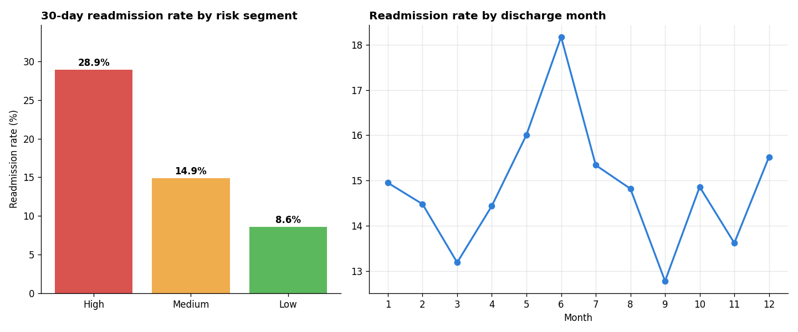

# Patient Readmission Risk Analysis

SQL analysis of hospital discharge encounters to find where 30-day readmissions concentrate, with outputs ready for Power BI.



## Results

Seed 42, 10,000 encounters.

| Measure | Value |
| --- | --- |
| 30-day readmissions | 1,486 (14.9%) |
| High-risk segment | 28.9% readmitted |
| Medium-risk segment | 14.9% |
| Low-risk segment | 8.6% |
| Highest department | General Medicine, 16.5% |

High-risk encounters readmit at more than three times the low-risk rate, so that group is where follow-up calls should start.

## Data

`generate_data.py` creates de-identified encounter records: department, diagnosis group, age band, length of stay, prior visits in the last 12 months, discharge month, and a 30-day readmission flag. There is no real patient data in this repo. Output is seeded and reproducible.

## How it works

1. Validate every row (known departments and diagnosis groups, valid age band, length of stay, prior visits, month, and readmission flag) and stop on duplicate encounter IDs. Then load into SQLite.
2. Use SQL to aggregate readmission rates by department, discharge month, and risk segment.
3. Segments are rule-based. High: 4+ prior visits or a 10+ day stay. Medium: 2+ prior visits or a 5+ day stay. Low: everything else. They are descriptive, not a clinical score.
4. Export `department_summary.csv`, `risk_segments.csv`, `monthly_trends.csv`, and `dashboard.html`.

## Run it

Python 3.9+. The analysis uses only the standard library; charts need matplotlib.

```bash
python3 generate_data.py --rows 10000
python3 analyze.py         # writes outputs/*.csv and outputs/dashboard.html
python3 make_charts.py     # writes docs/readmission_rates.png
python3 -m unittest -v
```

Use `--rows 70000` to test at a larger volume.

## Next steps

- Replace the rule-based segments with a calibrated risk model
- Validate against real outcomes with clinical review
- Build the Power BI report on top of the exported CSVs
